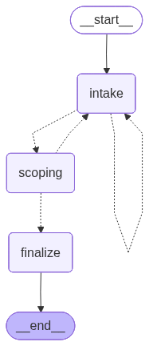

# 🤖 AI Business Assistant

A conversational AI agent designed to automate client intake, scheduling, and lead management for **any service-based business**. Built with **LangGraph**, **FastAPI**, and **Next.js**.

> Works out of the box for any service provider — studios, consultants, clinics, agencies, and more. Just drop in a business config file.



## 🚀 Features

-   **Conversational Intake**: An AI persona intelligently gathers client details (name, service type, date, attendee count) through natural dialogue.
-   **Real-Time Scheduling**: Integrates with **Google Calendar API** to check availability and propose alternative slots in real-time.
-   **Context Retention**: Remembers conversation history and context (e.g., knows what "it" refers to when a client accepts a slot).
-   **Smart Validation**: Validates requested services against the business's configured offerings and handles timezone-aware date parsing.
-   **Automated Confirmations**: Sends email notifications to the business manager via **Resend** upon successful booking.
-   **Multi-Business Support**: Configure multiple businesses via JSON profiles — each with their own services, pricing, rules, and timezone.

## 🛠️ Tech Stack

-   **Architecture**: Client-Server (REST API + WebSocket)
-   **Frontend**: Next.js 14, TypeScript, Tailwind CSS
-   **Backend**: Python 3.11+, FastAPI, Uvicorn
-   **AI Orchestration**: LangGraph, LangChain, OpenAI GPT-4o-mini
-   **Data Validation**: Pydantic
-   **External APIs**: Google Calendar, Resend

## ⚙️ Business Configuration

Each business is defined by a JSON config file in `backend/app/config/`. Example:

```json
{
    "services": {
        "consultation": { "duration": 1, "base_price": 150 },
        "full-project": { "duration": 8, "base_price": 1200 }
    },
    "timezone": "America/New_York",
    "rules": ["50% deposit required", "24-hour cancellation policy"],
    "requirements": [
        { "id": "client_name", "description": "Name of the client", "type": "string" },
        { "id": "service_type", "description": "Type of service requested", "type": "string" },
        { "id": "requested_slot", "description": "Preferred date and time", "type": "string" }
    ]
}
```

Add a new file (e.g., `my_business.json`) and pass `business_id=my_business` to target it at runtime.

## 📦 Installation

### Prerequisites
-   Python 3.11+
-   Node.js 18+
-   OpenAI API Key
-   Resend API Key
-   Google Cloud OAuth Credentials (for Calendar)

### Backend Setup

1.  **Navigate to backend**:
    ```bash
    cd backend
    ```
2.  **Install `uv`** (if not already installed):
    ```bash
    curl -LsSf https://astral.sh/uv/install.sh | sh
    ```
3.  **Install Dependencies**:
    ```bash
    uv sync
    ```
4.  **Environment Variables** — create a `.env` in the root directory:
    ```env
    OPENAI_API_KEY=your_openai_key
    RESEND_API_KEY=your_resend_key
    ```
5.  **Google Auth** — place your `credentials.json` in `app/auth/credentials.json`, then run:
    ```bash
    uv run app/auth/setup_auth.py
    ```

### Frontend Setup

1.  **Navigate to frontend**:
    ```bash
    cd frontend
    ```
2.  **Install Dependencies**:
    ```bash
    npm install
    ```

## 🏃‍♂️ Running the App

### 1. Start the Backend
From the `backend` directory:
```bash
uv run uvicorn app.api:app --reload
```
*API runs at `http://localhost:8000`*

### 2. Start the Frontend
From the `frontend` directory:
```bash
npm run dev
```
*App runs at `http://localhost:3000`*

## 🧠 Project Structure

-   `backend/app/agent/`: Modular LangGraph state machine (nodes, edges, graph, state, tools).
-   `backend/app/api.py`: FastAPI server with WebSocket support.
-   `backend/app/tools/`: Tool implementations (Google Calendar, business knowledge lookup).
-   `backend/app/config/`: JSON business profiles (one file per business).
-   `backend/app/data/leads.json`: Persisted lead records.
-   `frontend/`: Next.js chat interface.
-   `docs/`: Architecture diagrams and project documentation.

## 🚧 Roadmap

-   **Streaming Responses**: Real-time text streaming for a snappier UX.
-   **Voice Interface**: Speech-to-text for voice bookings.
-   **Payment Integration**: Stripe link generation upon booking confirmation.
-   **Admin Dashboard**: View and manage leads from a web UI.
